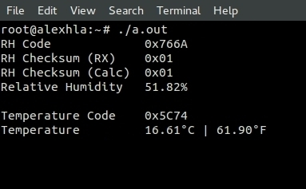
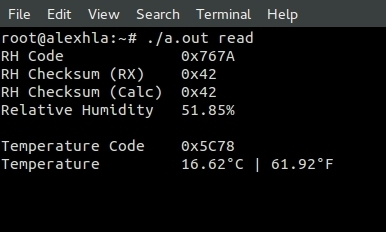
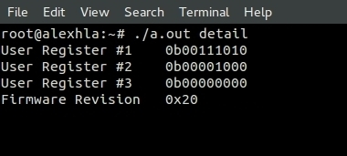
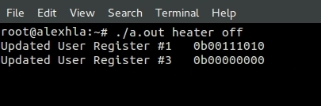

# humidity-temperature-sensor-Si7013-A20-driver
Driver for Silicon Labs Si7013-A20 I2C Humidity and Two-Zone Temperature Sensor

	

##### Download Source Files
$ curl -LO https://github.com/alexhla/humidity-temperature-sensor-Si7013-A20-driver/archive/master.zip
##### Unzip
$ unzip master.zip
##### Navigate to Project
$ cd humidity-temperature-sensor-Si7013-A20-driver-master
##### Compile
$ g++ main.cpp
##### Run
$ ./a.out

##### Read Humidity & Temperature

	
	

##### Read Detail Registers

	

##### Turn Heater ON with current (mA) setting 0-9

	

##### Turn Heater OFF

	

